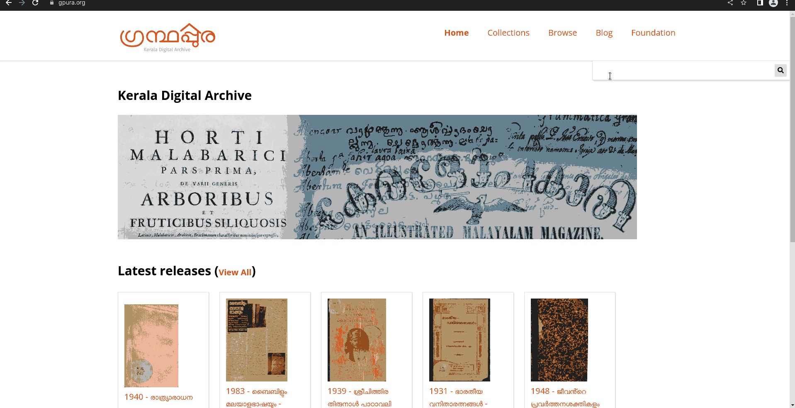

# Omeka S TypeSense live search

This module integrates [TypeSense](https://typesense.org/) type-as-you-search search into the default
Omeka S search to allow lightning fast, instant fulltext search and suggestions over the entire
Omeka S item database even with millions of items.

## Features
- Select properties to index.
- Configure fields to display in the search results.
- Automatically keep TypeSense search index up to date when items are added or removed.
- Schedule bulk re-indexing.
- Javascript autocomplete search widget automatically hooks on to frontend search box.

## Installation

- Install and run [TypeSense](https://typesense.org/docs/guide/install-typesense.html#option-2-local-machine-self-hosting)

Example:

```bash
docker run -p 8108:8108 -v/tmp/data:/data typesense/typesense:0.23.1 --data-dir /data --api-key=xxxxxx
```

- Clone this repository to the Omeka S module directory `~/path/to/omeka/modules`.
- `cd ~/path/to/omeka/modules` and run `composer install` to install the `typesense-php` dependency.
- Enable the module from the Admin → Modules menu.
- Connect the module to your TypeSense installation using the `Configure` form.

Search-as-you-type is now automatically hooked on to the search box on the Omeka S frontend.

## Screenshot

- Search
<br>


- Admin
<br>


## Credits
autocomplete.js is a modified version of [caroso1222/amazon-autocomplete](https://github.com/caroso1222/amazon-autocomplete)
